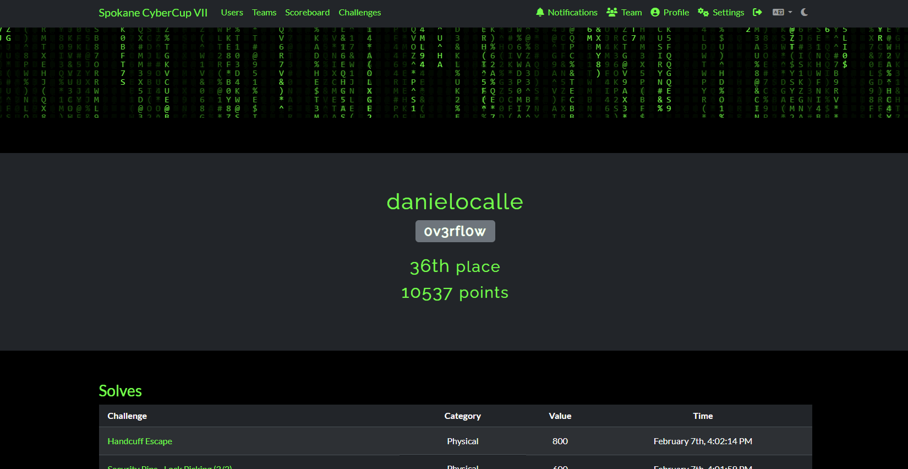
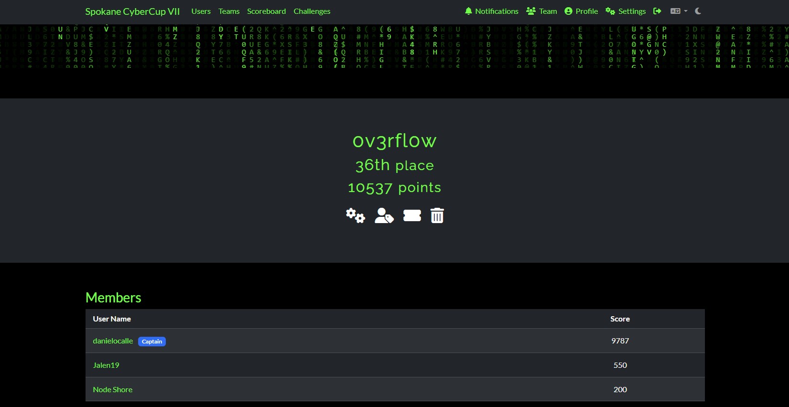
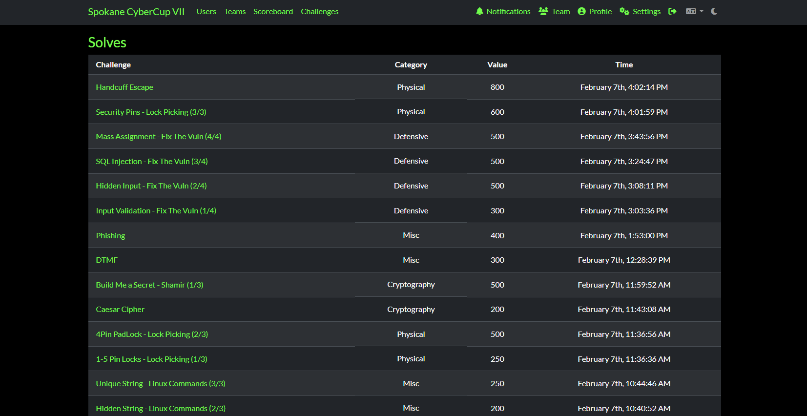
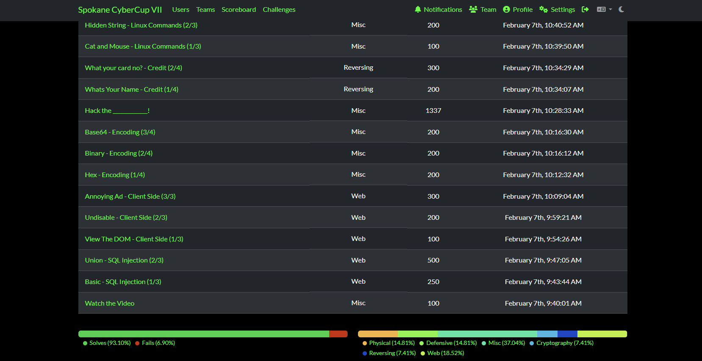

# Spokane Cyber Cup 2026
This repository contains proof of participation in the Spokane Cyber Cup event that took place February 7th, 2026. This is a record of my extracurricular participation for my own safe keeping and for a class requirement (CPT_S 427 @ Washington State University).

## Event Details
### Location and Date
- Spokane, Washington at the Gonzaga University Campus (Jepson Center Building)
- February 7th, 2026

### Type of Event
- Capture the Flag (CTF)

### List of CTF Challenges
Creator of the Spokane Cyber Cup, Maxwell Dulin, posted the challenges in a GitHub repository [(List of Challenges)](https://github.com/mdulin2/SC7)  
He also provided the Challenge Solutions Guide after the event had ended [(Solutions Guide)](/Spokane%20Cyber%20Cup%20VII%20Solution%20Guide.pdf)

## My Personal Challenge Solves and Total Points
   
   
  
